<p align="center">
  
</p>

# LLM Benchmark Protocol

**A Kendr research project**<br>
**Researcher:** Dr. Prashant Kumar Dey

[](https://github.com/Kendr-AI/LLM-Benchmark/actions/workflows/ci.yml)
[](https://github.com/Kendr-AI/LLM-Benchmark/actions/workflows/release-check.yml)
[](LICENSE)
[](pyproject.toml)

LLM Benchmark Protocol is a claim-first, system-aware framework and Python
reference implementation for evaluating language models, managed endpoints,
routers, agents, and AI applications. It makes planned denominators, system
classification, uncertainty, operational failures, evidence lineage, and
governance part of the benchmark rather than afterthoughts.

KGBP 1.0 is the repository's fully specified reference profile. The current
software release is `1.0.2`; the protocol profile remains KGBP 1.0, and the
frozen pilot correctly retains its original `1.0.0` execution provenance.
Software, profile, and benchmark campaign IDs are versioned independently.

> [!IMPORTANT]
> This is a **research release**, not an ISO standard, certification program,
> or declaration of global acceptance. The bundled design configuration clears
> all ten automated design-completeness gates at 10.0/10; that score describes
> the declared protocol design. Publication, conformity, or adoption claims
> still require execution evidence, competent independent review, external
> replication, and an authorized governance process.

## Why this protocol exists

Most leaderboards reduce unlike systems to one number. That can hide the facts
that a router is not a model, an unavailable endpoint did not answer, a safety
refusal can be correct, a ranking is statistically unresolved, or a narrow
English test cannot support a global claim.

LLM Benchmark Protocol addresses those problems by requiring evaluators to:

- define the intended claim and target population before measuring;
- classify the complete system under test across model, modality, deployment,
  orchestration, tool, safeguard, and access axes;
- freeze items, schedules, budgets, retry rules, graders, and estimands;
- retain every planned cell, including missing and failed observations;
- separate availability, conditional quality, end-to-end quality, latency,
  cost, risk, and operational goodput;
- model item, generation, cluster, day, and region uncertainty;
- publish machine-verifiable lineage, deviations, limitations, and corrections;
- keep controlled, open-elicitation, routing, agent, safety, and application
  results in explicitly labeled divisions.

```mermaid
flowchart LR
    C["Claim and target population"] --> S["System card and division"]
    S --> P["Preregistered items, budgets, and estimands"]
    P --> F["Frozen sample and interleaved schedule"]
    F --> O["Attempts, answers, judgments, and failures"]
    O --> I["Uncertainty-aware scorecards"]
    I --> E["Evidence bundle and independent review"]
    E --> D["Bounded decision or publication claim"]
```



## Ten-minute offline start

Python 3.11 or newer is required. No provider credential is needed for this
path.

```powershell
git clone https://github.com/Kendr-AI/LLM-Benchmark.git
Set-Location LLM-Benchmark
python -m venv .venv
.\.venv\Scripts\python.exe -m pip install -e ".[dev]"

.\.venv\Scripts\llm-benchmark-protocol.exe audit `
  config\global-protocol-v1.example.json `
  --output tmp\quickstart\audit `
  --strict

.\.venv\Scripts\llm-benchmark-protocol.exe score `
  examples\toy-observations.jsonl `
  --schedule examples\toy-schedule.jsonl `
  --output tmp\quickstart\scorecards `
  --bootstrap-samples 1000 `
  --seed 7
```

On macOS or Linux, activate `.venv/bin/activate` and use the commands without
the `.exe` suffix. The toy example proves two important behaviors: a wholly
missing planned capability cell is materialized with score zero, while an
appropriate refusal on the safety track can receive its preregistered credit.
Compare the generated files with [`examples/expected`](examples/expected).

Continue with the [quick start](docs/QUICKSTART.md), which adds a deterministic
schedule and an optional one-call paid smoke test.

## Installation and commands

Install from a tagged source archive or a clone:

```bash
python -m pip install "llm-benchmark-protocol @ git+https://github.com/Kendr-AI/LLM-Benchmark.git@v1.0.2"
```

The wheel carries its default cases, pricing data, constraints, example
protocol, and JSON Schemas, so commands work outside a repository checkout.

| Command | Purpose |
|---|---|
| `llm-benchmark-protocol` | Audit a protocol, plan power, freeze a schedule, or score observations without provider calls |
| `llm-benchmark` | Run a compact instrumented endpoint comparison |
| `llm-benchmark-livebench` | Set up, run, resume, finalize, or summarize the pinned LiveBench adapter |
| `llm-benchmark-matrix` | Execute and rebuild a common frozen LiveBench matrix across endpoints |

Legacy `kendr-*` command aliases and the `kendr_bench` Python namespace remain
available for compatibility. New integrations should use the public
`llm-benchmark-*` command names.

See the [provider adapter guide](docs/PROVIDER_ADAPTER_GUIDE.md) before a paid
campaign. Keep credentials in environment variables or an ignored `.env`
created from [`.env.example`](.env.example); never place secrets in protocol or
result files.

## Measurement model

The protocol distinguishes a finite frozen benchmark from the broader item
population an evaluator may wish to describe. It also decomposes an operational
endpoint into availability and quality:

```text
finite-benchmark estimand:  mu_s,t^B = (1/N_t) sum_i E_r[Y_sirt]
generalized estimand:       mu_s,t^G = E_(I ~ P_t)[E_r(Y_sIrt)]
availability:               A_s = P(S = 1)
conditional quality:       Q_s = E[Y | S = 1]
end-to-end quality:         E[S * Y] = A_s * Q_s
```

The frozen schedule is the denominator. Provider errors, exhausted retries,
timeouts, invalid outputs, missing required telemetry, and completely absent
cells cannot silently disappear. Safety tracks separately represent transport
status and policy outcome so a valid refusal is not confused with endpoint
failure.

The ten non-compensatory design dimensions are validity; sampling and power;
scoring and uncertainty; reliability and operations; cost and efficiency;
safety and robustness; fairness and global coverage; reproducibility and
transparency; governance and standards; and routing, agents, and applications.
Every dimension must be strictly above 9.0. A high average cannot compensate
for a failed critical control.

Read the [normative protocol](GLOBAL_BENCHMARK_PROTOCOL.md), [technical white
paper](output/pdf/LLM_Benchmark_Protocol_1_0_White_Paper.pdf), and
[statistical analysis plan](docs/STATISTICAL_ANALYSIS_PLAN.md) for definitions,
assumptions, estimators, multiplicity control, rank uncertainty, and evidence
requirements.

## Current-frontier execution snapshot

The repository also publishes a privacy-reviewed callable-subset matrix run on
2026-08-08. It used the dated current-frontier profile, 15 objective items
(three from each of five LiveBench task strata), one generation per
endpoint-item cell, Kendr-served defaults, and score-weighted operational
goodput as the primary metric.

| Rank | GA candidate | Kendr endpoint | Goodput | 95% interval | Availability |
|---:|---|---|---:|---:|---:|
| 1 | GPT-5.6 Sol | `kc-gpt-5.6-sol` | 79.4% | 60.0%–95.6% | 86.7% |
| 2 | Grok 4.5 | `kc-grok-4.5` | 72.0% | 46.7%–92.0% | 73.3% |
| 3 | Claude Opus 5 | `kc-claude-opus-5` | 68.9% | 46.7%–88.9% | 80.0% |
| 4 | Gemini 3.6 Flash | `kc-google-gemini-3-6-flash` | 33.1% | 12.0%–57.3% | 100.0% |
| 5 | DeepSeek V4 Flash 0731 | `kc-ollama-deepseek-v4-flash-0731` | 13.3% | 0.0%–33.3% | 13.3% |

GPT-5.5 was a declared comparison baseline, not a frontier candidate, and is
therefore unranked: its observed goodput was 68.9% with 73.3% availability.
Six other GA coverage targets were N/A rather than zero because they were not
callable under the frozen identity and access gates; two preview entries were
kept in a separate, unranked companion cohort.

The six scored endpoints produced 15 paired comparisons. Only two separated
after Holm family-wise correction at 5%: GPT-5.6 Sol versus DeepSeek V4 Flash
0731, and Claude Opus 5 versus DeepSeek V4 Flash 0731. GPT-5.6 Sol exceeded the
GPT-5.5 baseline by 10.4667 percentage points in the point estimate, but its
paired interval was [−2.6667, +28.7333] points (`p = 0.5`, Holm-adjusted
`p = 1.0`), establishing neither a difference nor practical equivalence.

See the [frontier execution handout](docs/FRONTIER_EXECUTION_LEADERBOARD_2026-08-08.md)
for the complete N/A register, corrected inference, methods, and limitations.
The sanitized aggregates are available as
[JSON](docs/data/frontier-2026-08-08/kendr-frontier-leaderboard-2026-08-08.json)
and [CSV](docs/data/frontier-2026-08-08/kendr-frontier-leaderboard-2026-08-08.csv),
with a bundle-local [SHA-256 manifest](docs/data/frontier-2026-08-08/SHA256SUMS).
The exact matrix ID is
`20260808T070202Z-frontier-market-kendr-20260808-cfec3672`.

> [!CAUTION]
> These are endpoint-as-served point estimates from a small English-oriented,
> one-generation slice. They are not a universal model ranking, certification,
> or evidence of global acceptance. Thirteen of 15 endpoint pairs did not
> separate after correction, and non-significance must not be called equality.

## Published 35-endpoint pilot

The repository publishes a sanitized, frozen catalog pilot executed through
the Kendr API on 2026-08-07 and released on 2026-08-08.

| Scope field | Frozen value |
|---|---|
| Catalog entries captured | 37 |
| Text-compatible endpoints ranked | 35 |
| Non-text entries reported as N/A | 2 |
| Questions | 15: three from each of five LiveBench task strata |
| Generations | One per endpoint-question cell |
| Primary metric | Score-weighted operational goodput |
| Pairwise family | 595 comparisons; 0 separated after Holm correction at 5% |
| Matrix ID | `20260807T135702Z-kendr-catalog-text-full-20260807-797042f1` |

Observed point-estimate leaders by division were:

| Division | Endpoint ID | Display name | Goodput | Availability |
|---|---|---|---:|---:|
| Fixed managed text endpoints | `kc-openai-gpt-5-5` | gpt-5.5 | 83.8% | 86.7% |
| Managed research systems | `kc-openai-gpt-5-3-codex` | gpt-5.3-codex | 61.4% | 93.3% |
| Routed systems | `kendr-flash` | Kendr Flash | 35.6% | 46.7% |

All 35 endpoint run records were finalized; seven endpoints had zero observed
answer availability. Those are endpoint-as-served outcomes for this campaign,
not proof that an underlying model is universally incapable. No matrix-level
or orchestration record was left incomplete.

The full table, canonical endpoint IDs, confidence intervals, failure counts,
cost bounds, methods, and limitations are in the [ranking handout](docs/RANKINGS_2026-08-08.md).
Machine-readable aggregates are available as [JSON](docs/data/kendr-catalog-pilot-2026-08-08.json)
and [CSV](docs/data/kendr-catalog-pilot-2026-08-08.csv), with a
[SHA-256 manifest](docs/data/SHA256SUMS).

> [!CAUTION]
> This pilot used 15 English-oriented objective items dated in 2024, one
> generation, sequential endpoint blocks, and no multilingual, multimodal,
> safety, fairness, regional-load, human-outcome, or external-replication
> study. Because none of 595 pairwise differences survived multiplicity
> correction, the printed row order is descriptive engineering evidence, not a
> resolved universal ranking.

## Documentation map

| Need | Start here |
|---|---|
| Understand the protocol in two pages | [Protocol card](docs/PROTOCOL_CARD.md) |
| Run the offline example or a smoke test | [Quick start](docs/QUICKSTART.md) |
| Adopt it as evaluator, provider, researcher, or buyer | [Adoption guide](docs/ADOPTION_GUIDE.md) |
| Interpret ranks, intervals, missingness, and equivalence | [Results interpretation](docs/RESULTS_INTERPRETATION.md) |
| Preregister estimands and analysis | [Statistical analysis plan](docs/STATISTICAL_ANALYSIS_PLAN.md) |
| Integrate another API or runtime | [Provider adapter guide](docs/PROVIDER_ADAPTER_GUIDE.md) |
| Produce conforming records | [Schema reference](docs/SCHEMA_REFERENCE.md) |
| Assemble auditable publication material | [Evidence bundle](docs/EVIDENCE_BUNDLE.md) |
| Threat-model a benchmark | [Threat model guide](docs/THREAT_MODEL.md) |
| Correct, appeal, or invalidate a result | [Appeals and corrections](docs/APPEALS_AND_CORRECTIONS.md) |
| Review common questions and claim boundaries | [FAQ](docs/FAQ.md) |
| Review the dated current-frontier coverage decision | [Frontier model coverage](docs/FRONTIER_MODEL_COVERAGE_2026-08-08.md) |
| Inspect the current-frontier callable-subset results | [Frontier execution leaderboard](docs/FRONTIER_EXECUTION_LEADERBOARD_2026-08-08.md) |
| Understand GPT-5.6 Sol versus the GPT-5.5 baseline | [Paired comparison analysis](docs/GPT_5_6_VS_5_5_ANALYSIS_2026-08-08.md) |
| Inspect the empirical pilot | [35-endpoint rankings](docs/RANKINGS_2026-08-08.md) |
| Review release changes and verification | [Release notes](docs/RELEASE_NOTES_v1.0.2.md) and [release process](RELEASING.md) |

Reusable system-card, benchmark-card, preregistration, deviation-log, and
threat-model files are under [`templates`](templates).

## Evidence and reproducibility

A credible result bundle links each frozen schedule cell to attempts, answers,
judgments, scored observations, scorecards, manifests, software/configuration
identities, and documented deviations. The schemas under [`config`](config)
are strict Draft 2020-12 JSON Schemas. Automated validation establishes
structural completeness only; it does not authenticate a provider response,
prove reviewer independence, or award publication status.

Raw paid-run artifacts remain ignored because they may contain prompts,
responses, request metadata, and sensitive information. This release publishes
privacy-reviewed aggregates and hashes, not the raw corpus. Follow the [data
license and provenance policy](DATA_LICENSE.md) before redistributing benchmark
content.

## Development

```powershell
python -m venv .venv
.\.venv\Scripts\python.exe -m pip install -e ".[dev,docs]"
.\.venv\Scripts\python.exe -m pytest
.\.venv\Scripts\python.exe scripts\verify_release.py
.\.venv\Scripts\python.exe -m build
```

CI tests Python 3.11-3.13, validates the example protocol and release surface,
and builds the wheel and source distribution. See [CONTRIBUTING.md](CONTRIBUTING.md),
[GOVERNANCE.md](GOVERNANCE.md), and the [Code of Conduct](CODE_OF_CONDUCT.md).
Security issues should follow [SECURITY.md](SECURITY.md), not a public issue.

## Citation, license, and status

Citation metadata is in [CITATION.cff](CITATION.cff). Cite both release
`v1.0.2` and the exact matrix ID when reusing the pilot results. The pilot's
recorded execution-software version remains `1.0.0` because this patch does not
retroactively relabel the frozen experiment.

Researcher and project-stewardship information is documented in
[AUTHORS.md](AUTHORS.md). The researcher is **Dr. Prashant Kumar Dey**, and the
reference implementation is published by **Kendr**.

Source code is available under the [MIT License](LICENSE). Published aggregate
results and third-party benchmark materials have the separate terms described
in [DATA_LICENSE.md](DATA_LICENSE.md).

The project welcomes public review and compatible independent replications.
Global acceptance, certification, accreditation, or standards-body endorsement
must never be inferred from a repository release, a design score, or a pilot
leaderboard.
