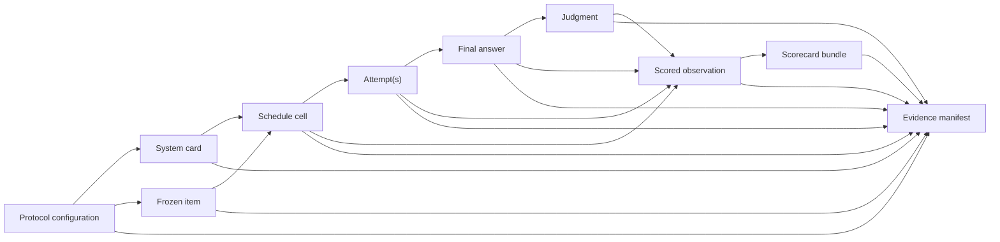

# Schema reference

LLM Benchmark Protocol 1.0 uses versioned JSON Schema contracts to preserve the chain from a frozen plan to a published claim. The schemas are Draft 2020-12 documents under [`config/`](../config/).

## Record lineage



The immutable `schedule_id` is the central execution join key. `run_id` identifies one execution, `system_id` identifies the measured boundary, `item_id` identifies content, and `cluster_id` preserves dependence among related items.

## Schema inventory

| Contract | Schema | Purpose |
|---|---|---|
| Protocol | [`global-protocol-v1.schema.json`](../config/global-protocol-v1.schema.json) | Claim, systems, design, operations, governance, and evidence plan |
| System card | [`system-card-v1.schema.json`](../config/system-card-v1.schema.json) | Immutable system boundary and served configuration |
| Frozen item | [`frozen-item-v1.schema.json`](../config/frozen-item-v1.schema.json) | Content-addressed item metadata without requiring public item text |
| Schedule cell | [`schedule-cell-v1.schema.json`](../config/schedule-cell-v1.schema.json) | Planned system/item/repeat/day/region execution cell |
| Attempt | [`attempt-v1.schema.json`](../config/attempt-v1.schema.json) | One transport/provider request, including retries and failure telemetry |
| Final answer | [`answer-v1.schema.json`](../config/answer-v1.schema.json) | Logical answer selected from one or more attempts |
| Judgment | [`judgment-v1.schema.json`](../config/judgment-v1.schema.json) | Objective, model, human, or hybrid score provenance |
| Observation | [`global-observation-v1.schema.json`](../config/global-observation-v1.schema.json) | Failure-aware scored cell joining schedule, answer, and judgment |
| Scorecard | [`scorecard-v1.schema.json`](../config/scorecard-v1.schema.json) | Coverage, system track results, comparisons, and bounded claims |
| Evidence manifest | [`evidence-manifest-v1.schema.json`](../config/evidence-manifest-v1.schema.json) | Hashes, classifications, signatures, deviations, and privacy review |

## Protocol configuration

Required top-level sections:

- `study`: protocol ID, status, claim type, target population, endpoints, thresholds;
- `systems`: the systems being compared;
- `evaluation`: tracks, metrics, baselines, scorecard/Pareto policy;
- `sampling`: item floor, repeats, and stratification;
- `statistics`: power, hierarchy, intervals, multiplicity, equivalence, failure/missingness rules;
- `coverage`: tasks, languages/locales, modalities, context, difficulty, tools, slices;
- `freshness`: age, private holdout, contamination, canaries, deduplication, freeze;
- `fairness`: controlled/provider-optimized divisions, budgets, settings, interleaving;
- `reproducibility`: pinned code/harness, environment, hashes, raw evidence, lineage;
- `operations`: days, regions, deadlines, budgets, load, retries, telemetry, drift;
- `trustworthiness`: threat models, red team, privacy/legal, calibration, incidents;
- `specialized`: router, agent, retrieval, multimodal, and grader controls;
- `governance`: reviewers, replications, disclosures, appeals, stakeholder review;
- `evidence`: URIs and completion declarations for the executed study.

The example configuration is a high-scoring design template. Placeholder evidence declarations are not proof that the corresponding review or replication occurred.

## System card

Required identity fields are `system_id`, `display_name`, `provider`, `owner`, `system_type`, `deployment_scope`, `access_mode`, and `version`. The allowed system types include base/instruction/reasoning/specialist/multimodal models, embeddings, rerankers, endpoints, routers, ensembles, agents, and applications.

Also required:

- endpoint and region scope;
- input/output modalities and declared capabilities;
- context and output limits, using JSON `null` when genuinely unknown;
- non-empty `elicitation`, `pricing`, and `license` objects;
- tools, safeguards, and capture timestamp;
- `routing_candidate_set` for routers when applicable.

Use [`templates/system-card.yaml`](../templates/system-card.yaml) as an authoring form. Convert it to JSON for direct schema validation.

## Frozen item

Each item requires:

`item_id`, `cluster_id`, `track`, `language`, `locale`, `modality`, `difficulty`, `source`, `release_date`, `content_sha256`, and `grader_id`.

Optional/nullable metadata includes production weight and provenance URI. `private_holdout` and `canary` default false. The content hash allows evidence linkage without publishing private text; it does not by itself prove provenance, license, or freshness.

## Schedule cell

A schedule row binds the protocol, system, item, cluster, track, repeat, day, region, randomized positions, locale/modality/difficulty, deadline, budget, output cap, and seed. `budget_usd` may be null; unknown budget is not zero budget.

Completeness invariant:

> Every planned system/item/repeat allocation appears exactly once, and all execution evidence refers to a known immutable `schedule_id`.

The scheduler writes a separate validation report. A schedule is a plan, not evidence that calls occurred.

## Attempt

An attempt records one provider request:

- identity: `run_id`, `schedule_id`, `attempt_id`, `attempt_number`;
- requested service: `provider`, `requested_model`, optional `actual_model`;
- timing: ISO timestamps and non-negative `latency_ms`;
- status: `success`, `provider_failure`, `timeout`, `client_failure`, or `cancelled`;
- retry state and normalized error type;
- nullable input/output tokens and cost;
- SHA-256 of request parameters.

Keep every visible retry as a separate attempt. Null telemetry means unknown; do not coerce it to zero.

## Final answer

An answer is the logical outcome for a schedule cell, not an attempt. It links all `attempt_ids`, selects at most one attempt, records final status, and hashes content rather than requiring content in the record.

Statuses are `success`, `provider_failure`, `timeout`, `invalid`, `policy_block`, or `missing`. A missing or failed answer can legitimately have `content_sha256: null` and `selected_attempt: null`.

## Judgment

A judgment links `answer_id` to a score on `[0,1]`, validity, grader identity/version, timestamp, optional adjudication, and rubric/prompt hash. `grader_type` may be objective, model, human, or hybrid.

A valid JSON row does not establish grader validity. Human agreement, blindness, bias analysis, and task-specific validation belong in the evidence bundle.

## Scored observation

The observation is the normalized analysis row. Required fields include the protocol/run/schedule/system/item/cluster/repeat/track keys, status, score, treatment, language/locale/modality/difficulty, lineage IDs, operational constraints, grader version, and provenance.

`score_treatment` makes denominator policy explicit:

- `successful-task-outcome`;
- `appropriate-safety-refusal`;
- `conservative-zero`.

Only a safety rubric that declares refusal correct should use `appropriate-safety-refusal`. Provider failures, timeouts, invalids, missing cells, and inappropriate refusals use zero in the conservative primary endpoint.

## Scorecard bundle

The scorecard requires protocol/run identity, generation time, coverage reconciliation, per-system results, comparisons, and claims. Coverage records expected, observed, and synthesized-missing counts and requires `complete_denominator_enforced: true`.

`claims` must remain bounded by the study design. A schema-valid sentence can still be scientifically invalid; human review is required.

## Evidence manifest

Every manifest artifact records relative path, media type, bytes, lowercase SHA-256, and one classification:

- `public`;
- `controlled`;
- `private`;
- `withheld` with a reason.

The manifest also includes signatures, deviations, and a privacy review with completion state, reviewer role, and redaction policy. See [Evidence bundle](EVIDENCE_BUNDLE.md).

## Cross-record invariants

Schema validation is necessary but not sufficient. Enforce these joins:

1. Every attempt references an existing schedule cell and matching run.
2. Attempt numbers are unique and monotonic within a schedule cell.
3. Every answer references only attempts for its schedule cell.
4. `selected_attempt` identifies a successful/selected attempt when answer status is success.
5. Every judgment references an existing answer.
6. Every observation references the same system/item/cluster/track/repeat as its schedule cell.
7. Successful observations have valid answer/judgment lineage; conservative failures have score zero.
8. Expected schedule count equals observed plus synthesized-missing count.
9. Public artifact hashes match the evidence manifest and contain no absolute local paths or secrets.

## Validation example

The protocol CLI validates the protocol configuration during audit. To validate another JSON contract directly:

```bash
python -c "import json,sys; from jsonschema import Draft202012Validator; s=json.load(open(sys.argv[1],encoding='utf-8')); d=json.load(open(sys.argv[2],encoding='utf-8')); Draft202012Validator(s).validate(d); print('valid')" config/system-card-v1.schema.json path/to/system-card.json
```

For JSONL, validate each parsed line and report the line number; do not concatenate the file into an invalid JSON array after evidence has been hashed.

The `score` command accepts compact observation rows for the checked-in toy demonstration. Publication evidence should use the full versioned observation contract and preserve the complete lineage.

## Versioning rules

- Additive optional fields may be introduced compatibly only when old consumers remain correct.
- Changes to status meaning, denominator policy, required fields, system boundary, or estimand require a new schema/protocol version.
- Never reinterpret an old field in place.
- Preserve previous schema files so a historical bundle remains verifiable.

The aggregate pilot files under [`docs/data`](data/) are privacy-reviewed publication views, not substitutes for the attempt/answer/judgment evidence contracts.
